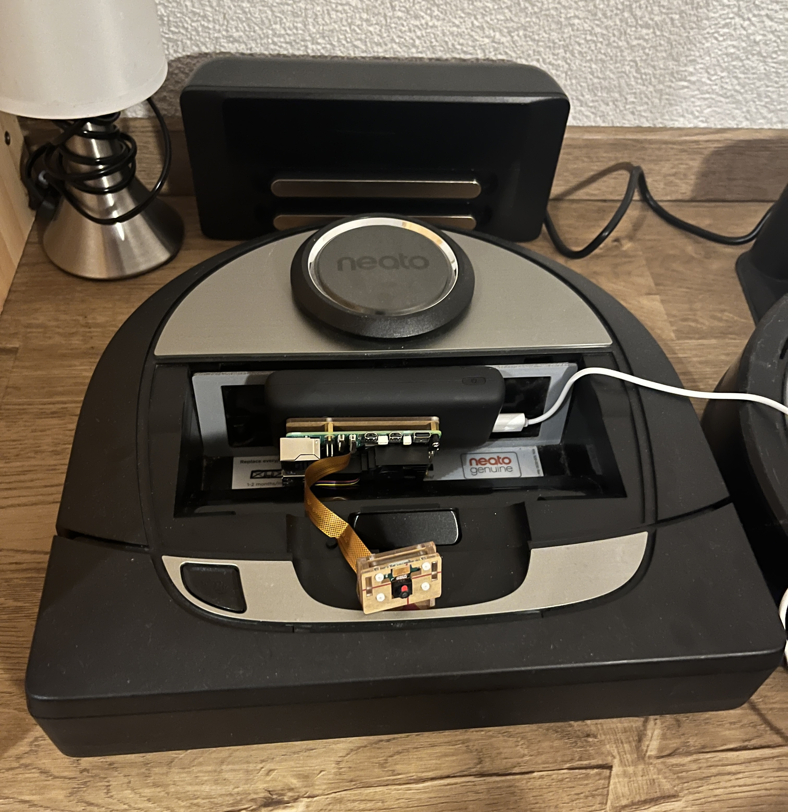
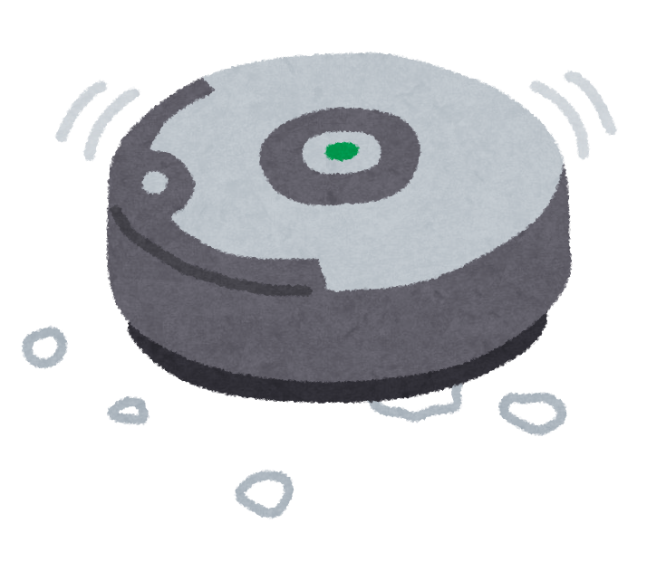
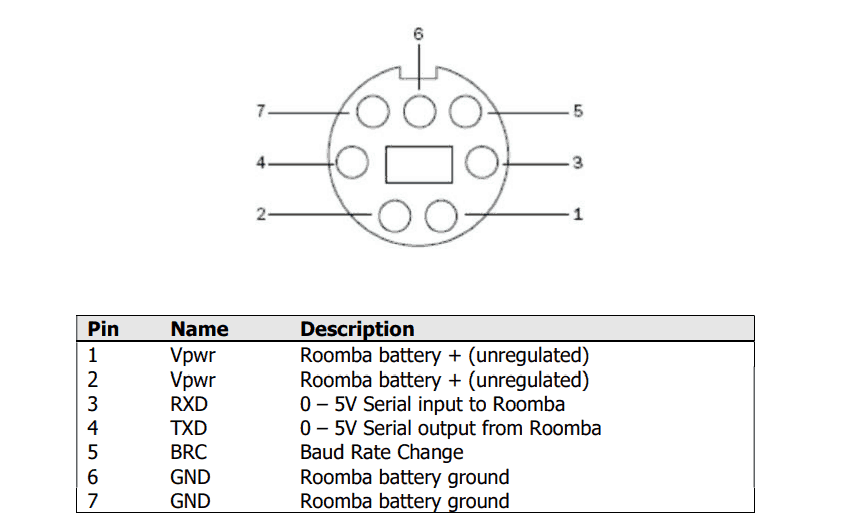

# Welcome to the Robotics Section

This project is dedicated to learning and experimenting with robotics systems through both hardware and software platforms.

## Topics Covered
- [Neato and ROS2](#neato-with-ros2-jazzy)
- [Roomba with PyRobot](#roomba-platform)
- [Vision](mechanical-design.md)

---

# 1. Neato with ROS2 Jazzy
This section is based on my undergraduate course, **ENGR3370 Computational Robotics**, and explores integrating the Neato platform with ROS2 Jazzy.
<p align="center">
  
</p>

### 1.1. Processor
The computing module is a **Raspberry Pi 5 (8GB RAM)** running **Ubuntu 24.04**, which provides robust support for ROS2 Jazzy.

### 1.2. Sensors & Actuators
- **CSI Interface Camera:** Official Raspberry Pi camera module.
- **LiDAR (Laser Distance Sensor):** Enables 360° scanning for navigation and mapping.
- **Infrared Sensors:** Detects obstacles and adjusts movement accordingly.
- **Bumper Sensors:** Detects physical collisions and initiates redirection.
- **Drop Sensors:** Prevents falls by detecting height changes.
- **Wheel Encoders:** Tracks movement and measures traveled distance.
- **Battery & Charging Sensors:** Monitors battery status and helps locate the charging dock.
- **USB Camera Module:** Planned integration of a high-resolution dual-camera setup.
- **ICM20948:** Future implementation of an accelerometer connected via Raspberry Pi GPIO.

### 1.3. Software
The Neato project is strictly based on the ROS2 platform as part of the learning process. The codebase structure is as follows:
```
├── gscam
│   ├── examples
│   ├── include
│   ├── scripts
│   └── src
├── image_processing
├── kalman_filters
├── my_pf
│   ├── cfg
│   ├── launch
│   └── scripts
├── neato_2dnav
│   ├── launch
│   ├── maps
│   ├── params
│   └── rviz
├── neato_basic_1
│   ├── drive_square_sample_1
│   ├── drive_square_sample_2
│   ├── drive_square_sample_3
│   ├── marker_sample
│   └── wall_approach_starter
├── neato_basic_2
│   ├── back_forth
│   ├── emergency_stop
│   ├── messages
│   ├── relative_motion
│   └── wall_approach
├── neato_description
│   ├── launch
│   ├── meshes
│   ├── rviz
│   ├── sdf
│   └── urdf
├── neato_driver
│   └── src
├── neato_gazebo
│   ├── launch
│   ├── model
│   ├── scripts
│   └── worlds
├── neato_node
│   ├── include
│   ├── launch
│   ├── msg
│   ├── nodes
│   └── src
├── neato_robot
├── neato_soccer
│   └── scripts
├── path_planning
├── probability_basics
│   └── figures
├── simple_filter
│   ├── cfg
│   ├── msg
│   └── scripts
└── teleop_twist_keyboard
```

---

# 2. Roomba Platform
This section explores using the **iRobot Roomba 865** as a chassis for robotics applications.
<p align="center">
  
</p>

### 2.1. Processor
#### 2.1.1. **Raspberry Pi Zero W**
The Raspberry Pi Zero W is a cost-effective, power-efficient option, but its official OS support is limited to **Raspbian Lite (Bookworm-based)**, which lacks native ROS2 support. Some modules failed during compilation, inspiring an alternative approach using Python-based robotics platforms such as [**PyRobot**](https://github.com/AtsushiSakai/PythonRobotics) and [**PySLAM**](https://github.com/luigifreda/pyslam).

Communication with the Roomba is established via **serial communication** through the **7-pin Mini-DIN port**, while video streaming and remote control are managed over **WLAN**.

**Issue:** The **7-pin Mini-DIN port** directly connects to the Roomba’s **14V battery**, which led to a burnt-out Raspberry Pi Zero W due to the lack of a voltage regulator.

#### 2.1.2. **Raspberry Pi Zero 2W**
To resolve the power issue, I upgraded to a **Raspberry Pi Zero 2W**, which features low power consumption and a **CSI-2 camera connector**. Additionally, I purchased an **official iRobot communication cable** with an integrated voltage regulation chip for safe operation.

#### 2.1.3. **Raspberry Pi 2** *(Backup Plan)*
A **Raspberry Pi 2** serves as a backup, supporting **Ubuntu 22.04 LTS** and **ROS2 Humble**. However, it lacks built-in Wi-Fi, requiring an **AIC8800-based USB network card** with additional driver installation.

### 2.2. Sensors & Actuators
- **Infrared Sensors:** Detect obstacles and prevent collisions.
- **Bumper Sensors:** Detects physical contact with objects.
- **Cliff Sensors:** Prevents falls by identifying ledges and stairs.
- **Dirt Detect Sensors:** Identifies areas requiring additional cleaning.
- **Wheel Encoders:** Tracks movement and distance traveled.
- **Battery & Charging Sensors:** Monitors battery levels and docking status.

<p align="center">
  
</p>
Please notice, all the communication between processor and roomba 865 chasis will thought this 7-pin mini-din port. The pwr of this mini DIN is directly connected to 14V battery pack output, potentiall cause permanent damage to the processor.

### 2.3. Software
```
├── ConvertedMarkdown.md
├── Roomba.md
├── __init__.py
├── gpio_roomba
│   ├── cmd_roomba.py
│   └── server.py
├── kinect_ROS
│   ├── CMakeLists.txt
│   ├── README.md
│   ├── cfg
│   ├── include
│   ├── launch
│   ├── package.xml
│   ├── rviz
│   └── src
├── pyRoomba_examples
│   ├── __init__.py
│   ├── go_and_back.py
│   ├── play_song1.py
│   ├── play_song2.py
│   └── sensors.py
└── pyroombaadapter.py
```

---

# 3. Computer Vision Study
## 3.1. Stereo Vision
### 3.1.1. Kinect Sensors
Both **Kinect Xbox 360** and **Kinect Xbox One** have ROS2 package support and Python wrappers, but they suffer from outdated software and lack of maintenance.

### 3.1.2. Dual Camera Setup
Exploring the integration of dual-camera setups for advanced stereo vision and depth estimation.

## 3.2. Semantic Segmentation
Investigating deep-learning-based segmentation techniques for robotic perception.

---

This document will be updated as the project progresses.

